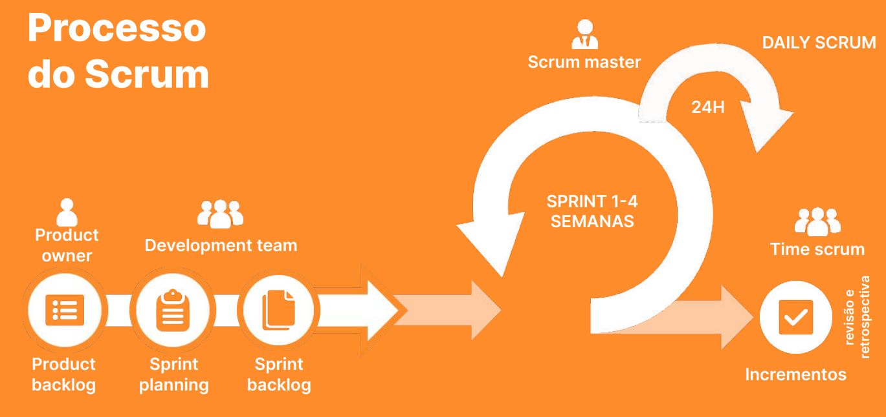

# O que é Scrum

## O que é Scrum?

Meio de gerenciar projetos de forma ágil

### Processo dinâmico e colaborativo

- Planejamento
- Execução
- Inspeção
- Adaptação

Trabalhar em um produto em ciclos curtos possibilita um feedback inicial do usuário, permitindo que você possa eliminar imediatamente tudo aquilo que constitui um desperdício de esforço

## Benefícios do Scrum

- Agilidade
- Colaboração, comunicação e adaptação do time a mudanças
- Melhor gestão de equipes
- Menor desperdício de recursos
- Identificação dos gargalos do projeto
- Motivação dos colaboradores

## Os 3 pilares do Scrum

- **Transparência**: Informação acessível a todos os envolvidos no projeto.
- **Inspeção**: Verificações constantes do processo de projeto.
- **Adaptação**: Adaptar o processo e/ou produto quando necessário.

## Valores

- Compromisso
- Foco
- Abertura
- Respeito
- Coragem

## Framework Scrum

### Papéis

Ocupação de cada membro do time

- Scrum Master,
- Product Owner,
- Development Team

### Artefatos

Informações essenciais para o andamento do projeto

- Product Backlog,
- Sprint Backlog,
- Incrementos

### Eventos

Encontros fixos do time

- Sprint Planning
- Sprint, Daily Scrum
- Sprint Review 
- Sprint Retrospective.

## Processo do Scrum

### Responsabilidades da pessoa Product Owner

- Definir requisitos do produto
- Alinhar as entregas do time
- Gerenciar e atualizar product backlog
- Iniciar e/ou cancelar uma Sprint

### O Scrum Master deve

- Aumentar a autonomia do time Scrum
- Ter conhecimento técnico sobre Scrum
- Entender e saber lidar com pessoas

### Responsabilidades do Scrum Master

- Garantir os valores, práticas e regras do Scrum
- Remover barreiras
- Dar feedbacks
- Garantir a produtividade do time
- Organizar e facilitar eventos Scrum

### Responsabilidades do time de desenvolvimento

Os desenvolvedores mais efetivos são aqueles que se envolvem e se engajam integralmente. Desde o entendimento dos problemas a serem resolvidos até a definição, a mplementação e a validação de soluções, trabalhando lado a lado com Product Owner, clientes, usuários e demais partes interessadas durante todo o processo.

- Elaborar um plano para a Sprint (Sprint Backlog)
- Determinar tecnicamente um incremento
- Coordenar e executar seu próprio trabalho
- Garantir a melhoria contínua do produto
- Informar impedimentos

