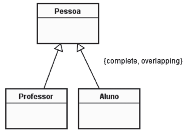
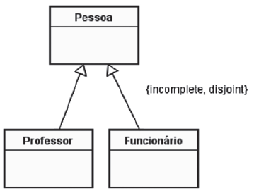
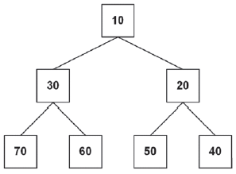
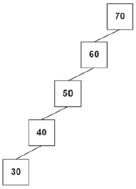

# QUESTAO NUMERO 31

- [Conhecimento](tecnologia-da-informacao/engenharia-de-software/devops/01-devops.md)
- [Conhecimento](tecnologia-da-informacao/engenharia-de-software/metodos-ageis/02-shift-left-testing.md)

No âmbito de DevOps, o termo "shift left testing" significa que os testes devem

- (A) ser feitos junto com a entrada em operação do produto.
- (B) ser feitos apenas no ambiente de desenvolvimento.
- (C) ser feitos apenas por meio de ferramentas de automação de testes.
- (D) ser feitos desde as fases iniciais do ciclo de vida do produto.
- (E) dirigir o desenvolvimento do produto.

# QUESTAO NUMERO 32

Uma universidade deseja implementar um sistema de controle de acesso às salas do seu campus. Esse sistema deve levar em consideração o seguinte cenário:

- Apenas três categorias de pessoas terão acesso às salas: professores, estudantes e funcionários;
- Alguns funcionários podem ser alunos da universidade;
- Alguns alunos podem ser professores da universidade.

A partir desse cenário, deve ser elaborado um modelo conceitual de classe UML, que contenha uma generalização. 

Qual generalização é compatível com o cenário acima?

- (A) 
- (B) 
- (C) 
- (D) 
- (E) 

# QUESTAO NUMERO 33

- [Conhecimento](tecnologia-da-informacao/engenharia-de-software/rup-processo-unificado/01-rup-processo-unificado.md)

Em quais fases do Processo Unificado (UP) o workflow (disciplina) de requisitos é executado?

- (A) Inception, Elaboration, Construction e Transition
- (B) Inception, Elaboration e Construction, somente
- (C) Elaboration e Construction, somente
- (D) Elaboration, somente
- (E) Inception, somente

# QUESTAO NUMERO 34

As classes Java a seguir pertencem ao pacote default.

```java
class A1 {
      protected int va1=1,va2=2;

      public A1(int x) {
             va1+=x;
             va2*=x;
      }
}

class A2 extends A1 {
      protected int vb1=10;
}

class A3 extends A2 {
      protected int vc1=0;

      public A3(int y) {
             vc1=(va1+va2)*y;
      }
```

Qual construtor poderá ser inserido na classe A2, sem que um erro de compilação seja gerado?

## A

```java
public A2() {
       vb1=va1+va2;
}
```

## B

```java
public A2(int z) {
       super(z); 
       vb1=va1+va2;
}
```

## C

```java
public A2() {
       vb1=va1+va2; 
       super(vb1);
}
```

## D

```java
public A2() {
       super(0); 
       vb1=va1+va2;
}
```

## E

```java
public A2() {
       super(vb1);
}
```

# QUESTAO NUMERO 35

Duas pilhas, p1 e p2, foram implementadas em Python, por meio de listas em que o último elemento da lista é o topo da pilha. As configurações iniciais dessas pilhas são as seguintes:

```python
p1=[50,40,30,20,10] 
p2=[ ]
```

Qual função irá transferir os elementos de p1 para p2, de modo que p1 passe a ser uma pilha vazia, e p2 passe a ter a mesma configuração que p1 tinha, antes da chamada da função?

## A

```python
def fa(p1,p2):
  if(len(p1)==0): 
       return 
  x=p1[len(p1)-1]
  fa(p1,p2) 
  p2.append(x)
```

## B

```python
def fb(p1,p2):
  if(len(p1)==0): 
       return 
  x=p1[len(p1)-1]
  del p1[len(p1)-1]
  fb(p1,p2)
  p2.append(x)
```

## C

```python
def fc(p1,p2):
  if(len(p1)==0):
       return
  p2.append(p1.pop())
  fc(p1,p2)
```

## D

```python
def fd(p1,p2):
  for i in range(len(p1)):
       p2.append(p1.pop())
```

## E

```python
def fe(p1,p2):
  for i in range(len(p1)):
       p2.append(p1[i])
```

# QUESTAO NUMERO  36

- [Conhecimento](tecnologia-da-informacao/engenharia-de-software/padroes-de-projetos/estruturais-proxy/01-padroes-estruturais-proxy.md)

Uma aplicação Java deve oferecer suporte para que os serviços disponibilizados por objetos que consomem muitos recursos possam ser requisitados, indiretamente, pelas demais classes (clientes) dessa aplicação. As soluções para esse problema de design devem impedir que esses objetos sejam diretamente referenciados pelos clientes, pois eles só devem ser instanciados quando seus serviços forem realmente solicitados.

A solução que a equipe de desenvolvimento propôs irá fornecer substitutos para esses objetos reais, de modo a controlar o acesso a eles. As classes dos objetos reais e dos objetos substitutos devem implementar uma mesma interface. Dessa forma, os substitutos servirão de representantes dos objetos reais. Eles receberão requisições dos clientes e as delegarão aos objetos reais.

A solução proposta pela equipe de desenvolvimento foi baseada no padrão de projeto

- (A) Facade
- [Conhecimento](tecnologia-da-informacao/engenharia-de-software/padroes-de-projetos/estruturais-facade/01-padroes-estruturais-facade.md)
- (B) Adapter
- [Conhecimento](tecnologia-da-informacao/engenharia-de-software/padroes-de-projetos/estruturais-adapter/01-padroes-estruturais-adapter.md)
- (C) Proxy
- [Conhecimento](tecnologia-da-informacao/engenharia-de-software/padroes-de-projetos/estruturais-proxy/01-padroes-estruturais-proxy.md)
- (D) Bridge
- [Conhecimento](tecnologia-da-informacao/engenharia-de-software/padroes-de-projetos/estruturais-bridge/01-padroes-estruturais-bridge.md)
- (E) Composite
- [Conhecimento](tecnologia-da-informacao/engenharia-de-software/padroes-de-projetos/estruturais-composite/01-padroes-estruturais-composite.md)

# QUESTAO NUMERO 37

- [Conhecimento](tecnologia-da-informacao/programacao/estrutura-de-dados-e-algoritmos/arvore-binaria/01-arvore-binaria.md)

Qual árvore binária pode ser classificada como árvore binária de busca?

- (A) 
- (B) 
- (C) 
- (D) 
- (E) 

# QUESTAO NUMERO  38

Leve em conta o conjunto de tabelas a seguir.

- CLIENTE (agencia, conta, CPF, nome, endereco, telefone, titular), onde titular = {1o,2o,3o,4o,5o}
- CONTA_CORRENTE (agencia, conta, data-de-abertura, saldo)
- MOVIMENTACAO (agencia, conta, data, hora, minuto, valor), onde data, hora e minuto são de uma movimentação (crédito ou débito) realizada

Considerando-se o modelo relacional de dados, composto apenas pelas tabelas CLIENTE, CONTA_CORRENTE e MOVIMENTACAO, verifica-se que

- (A) não é necessário ter os atributos "hora" e "minuto" como parte da chave primária da tabela MOVIMENTACAO.
- (B) o atributo "CPF" é uma chave estrangeira na tabela CLIENTE.
- (C) o atributo "data-de-abertura" deveria fazer parte da chave primária da tabela CONTA_CORRENTE.
- (D) o atributo ("titular" deveria fazer parte da chave primária da tabela CLIENTE.
- (E) os atributos "agencia" e "conta" na tabela CLIENTE formam uma chave estrangeira.

# QUESTAO NUMERO  39

Um sistema gerenciador de banco de dados utiliza metadados, persistidos em bancos de dados, para

- (A) avaliar o seu próprio desempenho, considerando metas pré-estabelecidas pelo administrador do banco de dados.
- (B) decidir que páginas de dados sujas na sua cache precisam ser persistidas em disco.
- (C) implementar o isolamento entre transações concorrentes.
- (D) permitir a restauração de um estado íntegro do banco de dados, em caso de falha.
- (E) validar comandos SQL informados por um usuário.

# QUESTAO NUMERO 40

- [Conhecimento](tecnologia-da-informacao/engenharia-de-software/analise-por-pontos-de-funcao/01-analise-por-pontos-de-funcao.md)

Uma equipe de desenvolvimento precisa informar a quantidade de pontos de função do software que será mantido por uma empresa.

Na contagem por ponto de função, um dos itens a ser considerado é o de

- (A) contagem das linhas do código
- (B) contagem de erros do software
- (C) funcionalidades implementadas, sob o ponto de vista do desenvolvedor
- (D) funcionalidades implementadas, sob o ponto de vista do usuário
- (E) funcionalidades implementadas, sob o ponto de vista do testador

# QUESTAO NUMERO 41

As classes Java a seguir pertencem ao pacote default e foram incluídas no arquivo Main.java.

```java
class MnopA {
      static int x=10,y=10,z=10;

      public MnopA() { 
            x*=2;
      }

      {
            y+=5;
            z+=10;
      }
}

class MnopB extends MnopA { 
      public MnopB(int c) {
            y*=c;
      }
      
      {
            z+=y;
      }
      
      static {
            x=y=z=1;
      }
}

public class Main {
      public static void main(String[] args) { 
            MnopB o=new MnopB(2);
            System.out.println(MnopB.x+MnopB.y+MnopB.z);
      }
}
```

O que será exibido no console quando o método main for executado?

- (A) 3
- (B) 4
- (C) 19
- (D) 27
- (E) 31

# QUESTAO NUMERO 42

- [Conhecimento](tecnologia-da-informacao/organizacao-e-arquitetura-de-computadores/dispositivos-de-hardware/mmu-memory-management-unit/01-mmu-memory-management-unit.md)

Na técnica de memória virtual, a tarefa de tradução dos endereços virtuais é realizada por hardware, juntamente com o sistema operacional, para não comprometer o desempenho.

O dispositivo de hardware responsável por essa tradução é a

- (A) FPU
- (B) ALU
- (C) MMU
- (D) VU
- (E) Cache

# QUESTAO NUMERO 43

O ext2 (Second Extended File System) é um dos sistemas de arquivos suportados pelo sistema operacional Linux.

Nesse sistema de arquivos, com exceção do nome do arquivo, todos os demais atributos, como permissões de acesso, identificação do dono do arquivo, identificação do grupo do arquivo, tamanho do arquivo, entre outros, são armazenados numa estrutura conhecida como

- (A) i-node
- (B) i-block
- (C) i-file
- (D) master file table
- (E) file allocation table

# QUESTAO NUMERO 44

A Unidade Central de Processamento (UCP) controla a operação de um computador e realiza suas funções e processamento de dados.

O componente da UCP que faz os cálculos ou o processamento de dados, de fato, é o(a)

- (A) decodificador de instrução
- (B) interpretador da instrução
- (C) registrador de instrução
- (D) unidade lógica e aritmética
- (E) unidade de controle

# QUESTAO NUMERO 45

No sistema decimal, os dígitos de 0 a 9 são utilizados para representar números na base 10. No sistema binário, apenas os dígitos 0 e 1 são utilizados para representar os números na base 2.

A representação do número decimal positivo 16.383, no sistema binário, utilizando 2 bytes, é

- (A) 0000 0111 1111 1111
- (B) 0000 1111 1111 1111
- (C) 0001 1111 1111 1111
- (D) 0011 1111 1111 1111
- (E) 0111 1111 1111 1111

# QUESTAO NUMERO 46

O processo de decodificação de uma instrução possibilita determinar o modo de endereçamento utilizado para localizar os operandos. Quando o operando tem magnitude limitada e sua busca não requer um ciclo de memória ou de cache dentro do ciclo de instrução, o modo de endereçamento utilizado pela instrução é o

- (A) imediato
- (B) direto
- (C) indireto
- (D) indireto por registrador
- (E) por deslocamento

# QUESTAO NUMERO 47

A sincronização entre processos concorrentes é fundamental para garantir a confiabilidade dos sistemas multiprogramáveis.

Um mecanismo de sincronização simples, que permite implementar a exclusão mútua sem a deficiência da espera ocupada (busy wait), é o

- (A) deadlock
- (B) mutual lock
- (C) escalonamento binário
- (D) buffer contador
- (E) semáforo mutex

# QUESTAO NUMERO 48

Na arquitetura TCP/IP, a tarefa da camada inter-redes é permitir que os hosts injetem pacotes em qualquer rede e prover o tráfego dos pacotes até o seu destino, sem garantia de ordem de entrega dos pacotes.

Dentre os protocolos utilizados nessa camada, tem-se o

- (A) TCP e o IP
- (B) UDP e o IP
- (C) ICMP e o IP
- (D) ICMP e o TCP
- (E) TCP e o UDP

# QUESTAO NUMERO 49

Em um sistema de transmissão de dados, o meio de transmissão é o caminho físico entre transmissor e receptor.

Como exemplos de meios de transmissão guiados, tem-se o

- (A) cabo par-trançado e o espectro de rádio por satélite
- (B) cabo par-trançado e o espectro de rádio terrestre
- (C) cabo de fibra ótica e o espectro de rádio por satélite
- (D) cabo de fibra ótica e o espectro de rádio terrestre
- (E) cabo de fibra ótica e o cabo par-trançado

# QUESTAO NUMERO 50

O serviço de correio eletrônico possibilita o envio e o recebimento de e-mail (electronic mail).

Os protocolos de comunicação que o cliente de correio utiliza para solicitar a entrega de um e-mail e para acessar a caixa postal de mensagens são, respectivamente, o

- (A) SFTP e o HTTP
- (B) HTTP e o IMAP
- (C) SMTP e o SFTP
- (D) SMTP e o IMAP
- (E) SMTP e o HTTP

# QUESTAO NUMERO 51

Um arquivo, contendo um documento XML, contém exatamente a seguinte informação:

```xml
<?xml version="1.0"?>
<PEDIDOS>
<PEDIDO>
<TITULO>Pedido de Empréstimo</TITULO>
<REQUERENTE>José da Silva</REQUERENTE>
<CPF>999.999.999-99</CPF>
<VALOR>20000</VALOR>
<PEDIDO>
<PEDIDOS>
```

A partir desse documento apenas, um processador XML pode garantir que o arquivo é

- (A) bem-formado, apenas
- (B) bem-formado e normalizado
- (C) bem-formado e válido
- (D) normalizado, apenas
- (E) válido, apenas

# QUESTAO NUMERO 52

Na camada de apresentação do Java EE 8, o uso de um gerente central que trata todos os pedidos (requests), ou um grupo de pedidos, para uma aplicação e os envia para um processo específico, é conhecido como

- (A) Abstract Command
- (B) Command
- (C) Data Access Object
- (D) Front Controller
- (E) Service Locator

# QUESTAO NUMERO 53

O Desenvolvimento Dirigido por Testes se caracteriza por

- (A) manter sem modificação um arquivo de código fonte que já tenha sido aprovado em um teste.
- (B) escrever o código fonte e, baseado na análise do código, escrever os testes.
- (C) escrever as histórias do usuário na forma de testes.
- (D) projetar os casos de teste antes de criar o código fonte.
- (E) repetir todos os testes a cada modificação do código fonte.

# QUESTAO NUMERO 54

Entre as principais ferramentas de gestão de configuração de software, estão os sistemas de controle de versão, como o svn ou cvs.

Nesses sistemas, o comando de registrar as mudanças locais em um repositório é denominado

- (A) branch
- (B) commit
- (C) save
- (D) store
- (E) update

# QUESTAO NUMERO 55

O modelo do CMMI 2.0 está organizado em áreas de prática, que se agrupam em áreas de capacidade, que, por sua vez, são agrupadas em 4 categorias.

A área de prática "Resolução e Prevenção de Incidentes" (Incident Resolution & Prevention – IRP) está agrupada dentro da categoria

- (A) Apoiando (Supporting)
- (B) Fazendo (Doing)
- (C) Gerenciando (Managing)
- (D) Melhorando (Improving)
- (E) Planejando (Planning)

# QUESTAO NUMERO 56

As fontes (feed) RSS devem todas fornecer informações em

- (A) CSS
- (B) HTML 1.0
- (C) HTML 1.1
- (D) SOAP
- (E) XML

# QUESTAO NUMERO 57

O teste de unidade tem como finalidade testar os componentes mais simples do software

- (A) de forma isolada.
- (B) quanto à sua coesão.
- (C) quanto ao seu acoplamento.
- (D) quando unificados na versão a ser lançada.
- (E) quanto à sua capacidade de responder a entradas únicas.

# QUESTAO NUMERO 58

Os Sistemas de Gerenciamento de Banco de Dados (SGBD) foram afetados pelas demandas trazidas pelo Big Data. Uma das formas de tratar essas demandas são os Sistemas de Gerenciamento de Banco de Dados Distribuídos (SGBDD), nos quais os dados podem estar armazenados em vários servidores, conectados por uma rede de computadores.

Um SGBDD que usa softwares middleware, de forma que os SGBDs que o compõem estejam fracamente acoplados, é conhecido como

- (A) Baseado em Grafos
- (B) Hierárquico
- (C) Federado
- (D) Orientado a objetos
- (E) NOSql

# QUESTAO NUMERO 59

Na linguagem de programação Kotlin, é possível criar uma variável cujo valor nunca pode ser mudado, na prática, uma constante, com o nome idademinima, do tipo básico inteiro de 32 bits, com o valor 18.

Para que isso aconteça, qual das seguintes instruções deve ser usada?

- (A) val idademinima : Int = 18
- (B) val idademinima : Integer = 18
- (C) val idademinima = 18 : Integer
- (D) var idademinima : Int = 18
- (E) var idademinima : Integer = 18

# QUESTAO NUMERO 60

A Resolução CMN no 4.893, de 26 de fevereiro de 2021, dispõe sobre a política de segurança cibernética e sobre os requisitos para a contratação de serviços de processamento e armazenamento de dados e de computação em nuvem, a serem observados pelas instituições autorizadas a funcionar pelo Banco Central do Brasil.

Essa Resolução determina que a política de segurança cibernética e o plano de ação e de resposta a incidentes devem ser, no mínimo, documentados e revisados

- (A) trimestralmente
- (B) semestralmente
- (C) anualmente
- (D) bienalmente
- (E) trienalmente
