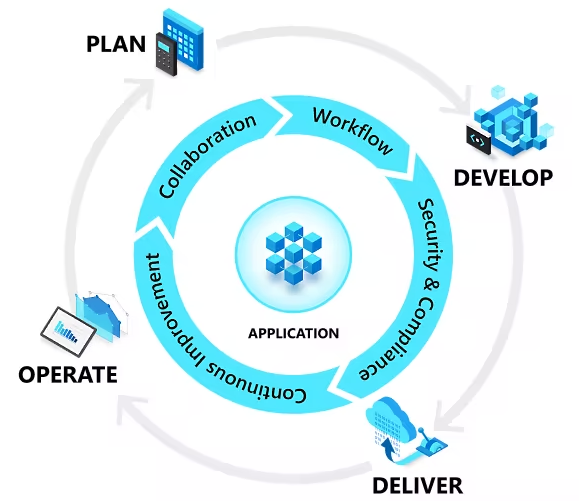

- [O que é o DevOps?](https://azure.microsoft.com/pt-br/resources/cloud-computing-dictionary/what-is-devops) : Descubra como o DevOps unifica pessoas, processos e tecnologias para oferecer aos clientes produtos de qualidade superior com rapidez.

# DevOps

Um composto de Dev (desenvolvimento) e Ops (operações), o DevOps é a união de pessoas, processos e tecnologias para fornecer continuamente valor aos clientes.

O DevOps permite que funções anteriormente isoladas – desenvolvimento, operações de TI, engenharia da qualidade e segurança – atuem de forma coordenada e colaborativa para gerar produtos melhores e mais confiáveis.

Ao adotar uma cultura de DevOps em conjunto com as práticas e ferramentas de DevOps, as equipes ganham a capacidade de responder melhor às necessidades dos clientes, aumentar a confiança nos aplicativos que constroem e cumprir as metas empresariais mais rapidamente.

## DevOps e o ciclo de vida do aplicativo

### Planejamento

As equipes de DevOps idealizam, definem e descrevem os recursos e as funcionalidades dos aplicativos e sistemas que estão construindo. Elas acompanham o progresso em níveis altos e baixos de granularidade, desde tarefas de produto único até tarefas que abrangem portfólios de vários produtos. Criar listas de pendências, acompanhar bugs, gerenciar o desenvolvimento de software Agile com o Scrum, usar quadros Kanban e visualizar o progresso com painéis são algumas das maneiras pelas quais as equipes de DevOps planejam com agilidade e visibilidade.

### Desenvolvimento

Inclui todos os aspectos da codificação – gravação, teste, revisão e integração do código pelos membros da equipe – bem como a compilação do código em artefatos de compilação, que podem ser implementados em vários ambientes. As equipes de DevOps buscam inovar rapidamente sem sacrificar a qualidade, a estabilidade e a produtividade. Para fazer isso, elas usam ferramentas extremamente produtivas, automatizam etapas elementares e manuais e iteram em pequenos incrementos por meio de testes automatizados e integração contínua.

### Entrega

É o processo de implantação de aplicativos nos ambientes de produção de maneira consistente e confiável. A fase de entrega também inclui a implantação e a configuração da infraestrutura fundamental totalmente governada que compõe esses ambientes.

Na fase de entrega, as equipes definem um processo de gerenciamento de versão com estágios claros de aprovação manual. Elas também definem portões automatizados que movem os aplicativos entre os estágios, até que sejam disponibilizados aos clientes. A automação desses processos os torna escalonáveis, repetíveis e controlados. Dessa forma, as equipes que praticam o DevOps podem frequentemente atuar e entregar com facilidade, confiança e tranquilidade.

### Operação

A fase de operação envolve manter, monitorar e solucionar problemas de aplicativos em ambientes de produção. Ao adotar as práticas de DevOps, as equipes trabalham para garantir a confiabilidade do sistema, a alta disponibilidade e o objetivo de tempo de inatividade igual a zero, reforçando a segurança e a governança. As equipes de DevOps buscam identificar os problemas antes que eles afetem a experiência do cliente e mitigar os problemas rapidamente quando ocorrem. Manter esse nível de vigilância requer telemetria avançada, alertas acionáveis e visibilidade total sobre os aplicativos e o sistema subjacente.

## Cultura do DevOps

- Colaboração, visibilidade e alinhamento
- Mudanças de escopo e de responsabilidade
- Ciclos de versão mais curtos
- Aprendizado contínuo
