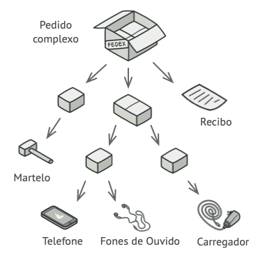

- [Composite](https://refactoring.guru/pt-br/design-patterns/composite): O Composite é um padrão de projeto estrutural que permite que você componha objetos em estruturas de árvores e então trabalhe com essas estruturas como se elas fossem objetos individuais.

# Padrões Estruturais - Composite

O Composite é um padrão de projeto estrutural que permite que você componha objetos em estruturas de árvores e então trabalhe com essas estruturas como se elas fossem objetos individuais.

## Problema

Usar o padrão Composite faz sentido apenas quando o modelo central de sua aplicação pode ser representada como uma **árvore**.

## Solução

O padrão Composite sugere que você trabalhe com Produtos e Caixas através de uma interface comum que declara um método para a contagem do preço total.

Como esse método funcionaria? Para um produto, ele simplesmente retornaria o preço dele. Para uma caixa, ele teria que ver cada item que ela contém, perguntar seu preço e então retornar o total para essa caixa. Se um desses itens for uma caixa menor, aquela caixa também deve verificar seu conteúdo e assim em diante, até que o preço de todos os componentes internos sejam calculados. Uma caixa pode até adicionar um custo extra para o preço final, como um preço de embalagem.

O maior benefício dessa abordagem é que você não precisa se preocupar sobre as classes concretas dos objetos que compõem essa árvore. Você não precisa saber se um objeto é um produto simples ou uma caixa sofisticada. Você pode tratar todos eles com a mesma interface. Quando você chama um método os próprios objetos passam o pedido pela árvore.

