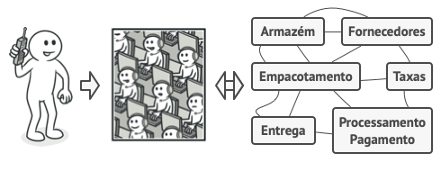

- [Facade](https://refactoring.guru/pt-br/design-patterns/facade): O Facade é um padrão de projeto estrutural que fornece uma interface simplificada para uma biblioteca, um framework, ou qualquer conjunto complexo de classes.

# Padrões Estruturais - Facade

O Facade é um padrão de projeto estrutural que fornece uma interface simplificada para uma biblioteca, um framework, ou qualquer conjunto complexo de classes.

## Problema

Imagine que você precisa fazer seu código funcionar com um amplo conjunto de objetos que pertencem a uma sofisticada biblioteca ou framework. Normalmente, você precisaria inicializar todos aqueles objetos, rastrear as dependências, executar métodos na ordem correta, e assim por diante.

Como resultado, a lógica de negócio de suas classes vai ficar firmemente acoplada aos detalhes de implementação das classes de terceiros, tornando difícil compreendê-lo e mantê-lo.

## Solução

Uma fachada é uma classe que fornece uma interface simples para um subsistema complexo que contém muitas partes que se movem. Uma fachada pode fornecer funcionalidades limitadas em comparação com trabalhar com os subsistemas diretamente. Contudo, ela inclui apenas aquelas funcionalidades que o cliente se importa.

Ter uma fachada é útil quando você precisa integrar sua aplicação com uma biblioteca sofisticada que tem dúzias de funcionalidades, mas você precisa de apenas um pouquinho delas.

Por exemplo, uma aplicação que carrega vídeos curtos engraçados com gatos para redes sociais poderia potencialmente usar uma biblioteca de conversão de vídeo profissional. Contudo, tudo que ela realmente precisa é uma classe com um único método codificar(nomeDoArquivo, formato). Após criar tal classe e conectá-la com a biblioteca de conversão de vídeo, você terá sua primeira fachada.

