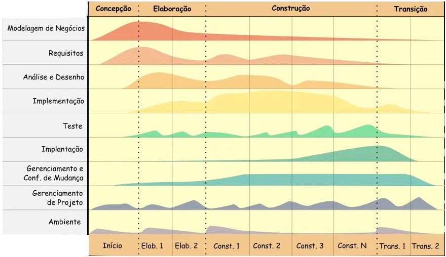

- [Engenharia de Software em Destaque: Processo Unificado (RUP).](https://www.estrategiaconcursos.com.br/blog/engenharia-software-processo-unificado-rup/): Vamos retomar hoje o nosso estudo em Engenharia de Software, uma das áreas de Tecnologia da Informação mais cobradas nas provas dos concursos públicos de alto nível. Falaremos hoje sobre o processo unificado, o famoso RUP.
- [O Processo Unificado](https://medium.com/contexto-delimitado/o-processo-unificado-d102b1fc9d00): Processo Unificado (Unified Process) foi criado em 1995 por Jim Rumbaugh, Grady Booch e Ivar Jacobson para suportar o paradigma de Orientação a Objetos.
- [Introdução ao Processo Unificado](https://www.devmedia.com.br/introducao-ao-processo-unificado/3931): O Processo Unificado (PU) surgiu como um processo popular para o desenvolvimento de software visando à construção de sistemas orientados a objetos.

# RUP - Processo Unificado

É um framework que visa apoiar o desenvolvimento de software.

## Principais Características

- **Iterativo e Incremental** - refinamentos sucessivos, com entregas divididas.
- **Guiado por Casos de Uso** - Eventos descritivos da interação do usuário com o sistema.
- **Centrado na Arquitetura** - Concepção dos componentes do sistema.
- **Orientado a Objetos** - Paradigma que facilita o reúso e a manutenção do sistema.
- **Focado em Riscos** - Gerenciamento de possíceis eventos que possam vir a impactar o projeto.

## Fases do RUP

- **Concepção**: fase responsável pela definição do escopo do projeto, ou seja, as tarefas que o projeto se propõe a entregar. Normalmente, efetua-se o levantamento inicial de requisitos nesta etapa.
- **Elaboração**: fase em que se concentra a análise do projeto, incluindo planejamento, especificações detalhadas e arquitetura do sistema. Apesar do nome, a elaboração também contempla o início da codificação.
- **Construção**: fase caracterizada pela codificação e testes de sistema propriamente ditos.  Ações relativas à implantação no ambiente também realizam-se massivamente nesta etapa.
- **Transição**: última fase do projeto, que contempla majoritariamente a conclusão dos testes e a implantação do sistema no ambiente. Se necessários, acertos finais no código também são bem-vindos.

## Disciplinas do RUP

- **Modelagem** de negócios: identifica o contexto de negócios do sistema, incluindo o funcionamento da organização em que a solução será implantada.
- **Requisitos**: alinhamento do que o sistema deve fazer, ou seja, definição das funcionalidades necessárias ao sistema, segundo as expectativas do cliente.
- **Análise e design**: definição da arquitetura do sistema, de acordo com os requisitos levantados na etapa anterior. Em outras palavras, é a fase responsável pela modelagem do projeto.
- **Implementação**: além de realizar a codificação da solução propriamente dita, em conformidade com a análise prévia realizada, esta etapa também contempla testes unitários.
- **Teste**: etapa que realiza a maior parte dos testes da aplicação, visando localizar e documentar defeitos na qualidade do software desenvolvido.
- **Implantação**: cria uma nova versão do produto, instalando-o no ambiente e distribuindo-a para a utilização dos usuários. Em outras palavras, essa é a etapa que coloca a solução em produção.
- **Gerenciamento de configuração e mudança**: responsável por gerenciar o versionamento do produto / itens de configuração, além de apoiar eventuais processos de mudança.
- **Gerenciamento de projeto**: conjunto de ações para realizar um apoio ao monitoramento e à gestão dos projetos de software. Fique atento, pois essa disciplina não tem relação com PMBOK (ao contrário, é bem mais simples).
- **Ambiente**: etapa que disponibiliza as ferramentas necessárias no ambiente para o desenvolvimento do sistema, incluindo também configuração de hardware e software.
